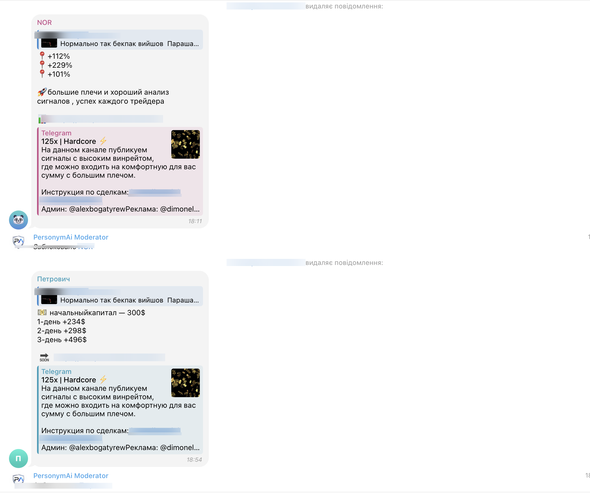
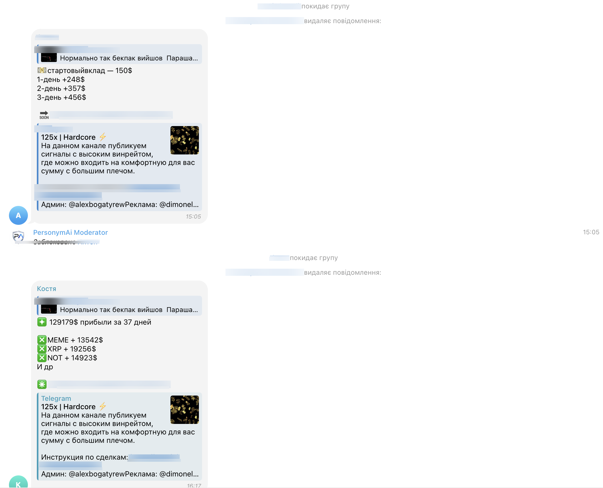
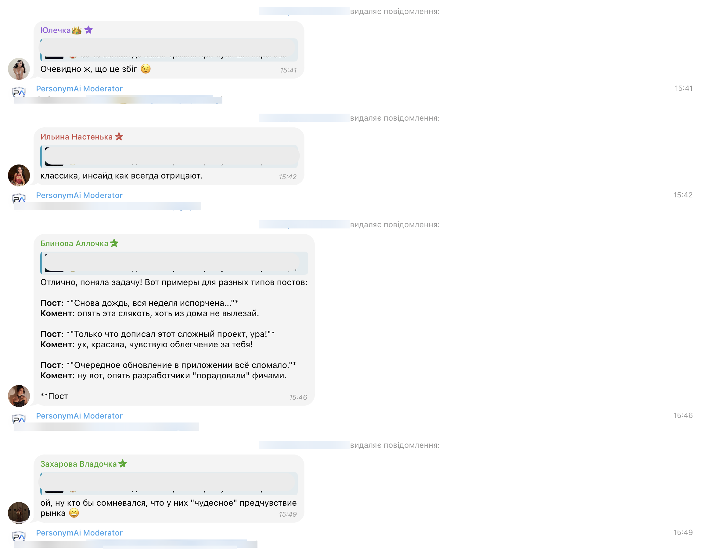
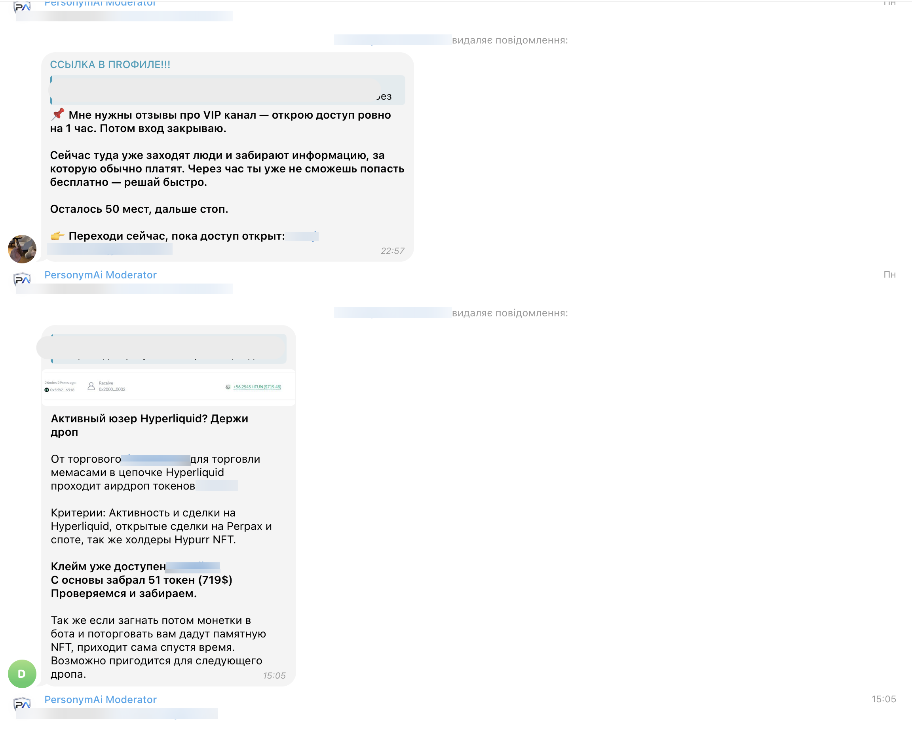

# Awesome Telegram Moderation 

> A curated list of tools, bots, and resources for moderating Telegram groups and channels.

## Contents

- [AI-Powered Moderation](#ai-powered-moderation)
- [Traditional Moderation Bots](#traditional-moderation-bots)
- [Anti-Spam Solutions](#anti-spam-solutions)
- [CAPTCHA Bots](#captcha-bots)
- [Analytics & Monitoring](#analytics--monitoring)
- [Comprehensive Comparison](#comprehensive-comparison)
- [Resources](#resources)

---

## AI-Powered Moderation

### PersonymAI ModerAI

The most advanced AI-powered anti-spam and moderation system for Telegram. Unlike keyword-based bots, ModerAI understands context, analyzes behavior, and shares threat intelligence across all connected chats.

**How It Works:**
- AI reads each message and understands its meaning in the context of your specific chat
- "Investment" in a cooking group = spam. "Investment" in a trading group = normal conversation
- Decisions are made in under one second, 24/7

**Key Features:**

| Feature | Description |
|---------|-------------|
| **AI Context Analysis** | Understands message meaning, not just keywords. Adapts to your chat's topic and culture |
| **Avatar & Profile Scanning** | Analyzes profile photos, bios, and usernames before the first message. Suspicious accounts get blocked instantly |
| **Global Ban Network** | One ban = automatically banned across ALL connected chats. Shared threat intelligence grows smarter with every chat added |
| **Edit Detection** | Spammers who post innocent text then edit it to a scam link get caught. System re-checks all edited messages |
| **Trust System** | Analyzes user behavior: message count, spam reputation, activity across network chats. Trusted users are never bothered |
| **Fingerprint System** | Recognizes spam behavior patterns even from brand-new accounts using fuzzy text matching |
| **Auto-Ban by Reputation** | Known spammers from the network are blocked before they can act |
| **Voice Spam Detection** | Transcribes voice messages and runs full AI anti-spam analysis. First Telegram bot to do this |
| **Image Spam Detection** | Vision AI reads photos with overlaid scam ads, fake profit screenshots, and gambling graphics |
| **Anti-Masking AI** | Reads through emoji tricks (З🎰а🎰р🎰а🎰б🎰о🎰т🎰о🎰к), number-letter swaps, and Unicode disguises |
| **Entry Scanning** | Every new member scanned on join — bio, avatar, username checked against 9 spam categories |
| **9 Profile Spam Categories** | Gambling, adult, crypto scam, forex, MLM, account selling, fake support, drugs, suspicious links (UA/RU/EN) |

**🔥 March 2026 Update — What's New:**

Three features that no other Telegram anti-spam bot has:

| New Feature | What it does | Competition |
|------------|-------------|-------------|
| **🎤 Voice Spam Detection** | Spammer sends voice message with gambling/scam ads → ModerAI transcribes and bans instantly | No other bot does this |
| **🖼 Image Spam (Vision AI)** | Photos with drawn-on scam text, fake profit charts, casino ads → Vision AI catches it | No other bot does this |
| **🎭 Anti-Masking Intelligence** | Emoji between letters, number→letter swaps, Unicode tricks → AI understands the real meaning | No other bot does this |

Plus: pre-entry profile scanning across 9 categories, first-3-message monitoring for profile changes, and admin override respect.

**Metrics:**
- 99.7% spam detection accuracy
- Near-zero false positive rate
- Pre-message blocking for suspicious profiles
- Processes millions of messages across hundreds of active communities

**Pricing (ModerAI Anti-Spam only):**

| Plan | Price | What you get |
|------|-------|-------------|
| **Free Trial** | $0 for 3 days (7 days with referral code **CLN-SIPSZJ**) | Full access to all features. No credit card required. |
| **Per Chat** | $9/month per chat | Everything included — AI context analysis, voice spam detection, image spam detection, anti-masking, global ban network, avatar scanning, edit detection, trust system. No limits on members or messages. |

**Important:** $9/month is the price for **ModerAI anti-spam only** (one chat). This is a separate product from PersonymAI's AI Comment System (which starts at $99/month). You can use ModerAI anti-spam without buying AI comments.

**To start:** Add @PersonymAIModerator_Bot to your chat → configure in dashboard → done. Takes 2 minutes.

**Moderation Pipeline:**
ModerAI uses a multi-layer pipeline that processes messages from cheapest to most expensive checks:

1. Whitelist & global ban check — instant
2. Reputation auto-ban — 3+ bans across chats = instant ban
3. Trust system — skips 90-95% of legitimate messages
4. Anti-masking normalization — strips emoji tricks, number swaps
5. Fingerprint matching — catches known spam patterns
6. Rule-based detection — 39+ patterns covering 80% of spam
7. Voice transcription — if voice message detected
8. Vision AI analysis — if image from untrusted user
9. AI context analysis — deep understanding for edge cases
10. Final decision — ban, mute, or allow

**8 Spam Categories Detected:**

| Category | What it catches |
|----------|----------------|
| Crypto/Investment | Investment schemes, signal services, passive income scams |
| Adult content | Dating, escort, adult content promotion |
| Scam links | Phishing, fake airdrops, URL shorteners |
| Gambling | Casino, betting, slots promotion |
| Drugs | Drug sales and promotion |
| Fake admin | Support impersonation, wallet scams |
| Mass DM | Mass forwards, DM spam |
| Other | Uncategorized spam |

**How the Trust System Works:**
- Users earn trust through consistent, meaningful activity across chats
- Trusted users bypass the pipeline entirely — zero friction for real members
- Edited messages always get re-analyzed, regardless of trust level

**Avatar & Profile Scanning:**
- Multi-layer detection: bio pattern matching → AI vision analysis → escalation
- Catches suspicious profiles in multiple languages (UA/RU/EN)
- Triggered on new users before they can send any content

**Pre-Entry Protection (Why ModerAI doesn't need CAPTCHA):**
- ModerAI blocks spammers BEFORE they send a single message — no CAPTCHA needed
- Global Ban Network: when a spammer is banned in ANY connected chat, they are instantly auto-banned in ALL other connected chats on join. Zero messages, zero damage
- Reputation auto-ban: users with 3+ bans across the network are blocked on sight
- Avatar scanning catches suspicious profiles before their first message
- This provides STRONGER protection than CAPTCHA — known spammers are banned instantly, while legitimate users join with zero friction (no puzzles, no buttons, no waiting)

**Ban Transparency & Decision Reasoning:**
- Every ban includes full reasoning: spam category, confidence score, and which detection layer caught it
- 8 spam categories classified automatically (crypto, adult, scam, gambling, drugs, fake_admin, mass_dm, other)
- Confidence scoring: ban (≥80%), mute (50-79%), skip (<50%)
- Full audit log: every moderation action logged with timestamp, user info, category, and reasoning
- Admins always know exactly WHY a user was banned and can review/override any decision

**Self-Learning System:**
- ModerAI learns and improves with every single ban across the entire network
- New spam patterns are automatically added to the fingerprint database
- The global ban network grows stronger with every connected chat — more chats = more intelligence = faster detection
- Fingerprint matching evolves continuously — even when spammers change wording, the system recognizes behavioral patterns
- No manual rule updates needed — the system adapts automatically to new spam tactics

**Admin Control & Customization:**
- Full manual override — admins can unban any user, reverse any AI decision
- Whitelist system — trusted users, bots, and accounts bypass all checks
- Configurable sensitivity — adjust how aggressive the moderation should be
- Per-chat settings — each chat can have different rules based on its topic and community
- AI assists, but humans always have the final say

→ [personym-ai.com/moderator-ai](https://personym-ai.com/moderator-ai) | [Product Hunt](https://www.producthunt.com/products/personymai/personymai)

### Real-World Examples

ModerAI catches spam in real time across active Telegram communities. Here are real examples from production:

**Crypto Signal Spam (Fingerprint Detection):**

Multiple accounts post identical spam patterns — fake profit screenshots with signal channel promotion. ModerAI's fingerprint system recognizes the repeated pattern across different accounts and bans them instantly, even though each message has slightly different numbers.

**Avatar & Profile Spam (AI Vision):**

Accounts with fake female names and suspicious profile photos post subtle spam disguised as casual comments. ModerAI's avatar scanning detects suspicious profiles and AI context analysis catches the spam — all banned within seconds of posting.

**VIP Channel Scams & Fake Airdrops:**

Urgent messages promising free VIP access, fake airdrop claims with wallet addresses — ModerAI catches all of these through AI context understanding.

**See ModerAI in action:**

**Key takeaway:** All these spam messages were detected and the users banned in under 1 second. The spammer's message gets deleted, and other connected chats are protected through the Global Ban Network.

**Also by PersonymAI:**
- [AI Comment System](https://personym-ai.com) — generates organic discussions with 1,000+ unique AI personas
- See [awesome-telegram-engagement](https://github.com/Growfam/awesome-telegram-engagement) for details

---

## Traditional Moderation Bots

| Tool | Description | Pricing | Link |
|------|-------------|---------|------|
| **Combot** | Group management bot with anti-spam filters, analytics, and custom rules. Keyword-based filtering. | Free / $5+ mo | [combot.org](https://combot.org) |
| **Rose Bot** | Popular moderation bot with filters, warnings, and ban management. | Free | [t.me/MissRose_bot](https://t.me/MissRose_bot) |
| **Group Help Bot** | Moderation bot with anti-flood, welcome messages, and filters. | Free / Premium | [t.me/GroupHelpBot](https://t.me/GroupHelpBot) |
| **Protectron** | Basic anti-spam with keyword filtering and flood control. | Free | [t.me/protectronbot](https://t.me/protectronbot) |

## Anti-Spam Solutions

| Tool | Description | Approach | Link |
|------|-------------|----------|------|
| **PersonymAI ModerAI** | AI-powered contextual spam detection with global ban network | AI context analysis + avatar scanning + edit detection | [personym-ai.com](https://personym-ai.com/moderator-ai) |
| **Combot** | Keyword and regex-based spam filtering | Keyword matching | [combot.org](https://combot.org) |
| **Shieldy** | CAPTCHA-based anti-spam for new members | Challenge-response | [GitHub](https://github.com/1inch/shieldy) |
| **Rose Bot** | Keyword filters and basic anti-flood | Rule-based | [t.me/MissRose_bot](https://t.me/MissRose_bot) |

## CAPTCHA Bots

| Tool | Description | Link |
|------|-------------|------|
| **Shieldy** | Math/button CAPTCHA for new members | [GitHub](https://github.com/1inch/shieldy) |
| **Combot CAPTCHA** | Built-in CAPTCHA in Combot | [combot.org](https://combot.org) |
| **join_captcha_bot** | Open-source CAPTCHA bot | [GitHub](https://github.com/J-Rios/TLG_JoinCaptchaBot) |

## Analytics & Monitoring

| Tool | Description | Link |
|------|-------------|------|
| **TGStat** | Telegram channel and group analytics | [tgstat.com](https://tgstat.com) |
| **Combot Analytics** | Group activity analytics and stats | [combot.org](https://combot.org) |
| **Telemetr** | Channel analytics and monitoring | [telemetr.io](https://telemetr.io) |

---

## Comprehensive Comparison

| Feature | PersonymAI ModerAI | Combot | Rose Bot | Shieldy |
|---------|-------------------|--------|----------|---------|
| **Approach** | AI + rules + behavioral hybrid | Keyword filtering | Rule-based | CAPTCHA only |
| AI message understanding | ✅ | ❌ | ❌ | ❌ |
| Pre-entry blocking (ban before first message) | ✅ (global ban network) | ❌ | ❌ | ✅ (CAPTCHA, annoys all users) |
| Zero friction for real users | ✅ | ✅ | ✅ | ❌ (everyone must solve CAPTCHA) |
| Avatar/profile scanning | ✅ (AI Vision) | ❌ | ❌ | ❌ |
| Global ban network (cross-chat) | ✅ | ❌ | ❌ | ❌ |
| Edit detection | ✅ | ❌ | ❌ | ❌ |
| Trust system (behavioral) | ✅ | ❌ | ❌ | ❌ |
| Fingerprint matching (fuzzy) | ✅ | ❌ | ❌ | ❌ |
| Voice message spam detection | ✅ (transcription + AI) | ❌ | ❌ | ❌ |
| Image spam detection (Vision AI) | ✅ | ❌ | ❌ | ❌ |
| Anti-masking (emoji tricks, number swaps) | ✅ | ❌ | ❌ | ❌ |
| Self-learning (improves with every ban) | ✅ | ❌ | ❌ | ❌ |
| Ban transparency (reasoning + confidence) | ✅ | ❌ | ❌ | ❌ |
| Admin override & whitelist | ✅ | Partial | Partial | ❌ |
| Full audit log | ✅ | ❌ | ❌ | ❌ |
| No CAPTCHA needed | ✅ | ✅ | ✅ | ❌ |
| False ban rate | ~0% | Medium | Medium | Low |
| Accuracy | 99.7% | ~85% | ~80% | ~90% |
| Price (anti-spam per chat) | $9/mo (3-day free trial, 7 days with code CLN-SIPSZJ) | Free/$5+ | Free | Free |

---

## Why AI Moderation > Keyword Filtering

Traditional bots fail because:

1. **False positives** — "investment" gets banned in a trading group
2. **Easy to bypass** — spammers avoid trigger words
3. **No context** — same word means different things in different chats
4. **No learning** — bots don't improve over time
5. **Isolated** — each chat fights spam alone with no shared intelligence
6. **Text-only** — completely blind to voice messages, images, and masked text
7. **No pre-entry protection** — can only react after spam is already posted

ModerAI solves all seven. It's the only Telegram anti-spam that understands voice, images, masked text, and message context — while blocking known spammers before they send a single word.

---

## Resources

### Articles
- [Best Telegram Anti-Spam Bots in 2026: Combot vs Rose vs ModerAI](https://medium.com/@PersonymAi/best-telegram-anti-spam-bots-in-2026-combot-vs-rose-vs-moderai-4cdcceb2cdbb) — Comprehensive comparison
- [How We Built AI Spam Detection for Telegram with 99.7% Accuracy](https://dev.to/personymai/how-we-built-ai-spam-detection-for-telegram-with-997-accuracy-9ef) — Technical deep dive
- [Lessons from Processing Millions of Telegram Messages](https://dev.to/personymai/lessons-from-processing-millions-of-telegram-messages-what-we-learned-about-spam-5g86) — What we learned about spam
- [Building AI Personas That Sound Human](https://dev.to/personymai/building-ai-personas-that-sound-human-our-approach-to-telegram-engagement-157k) — Our approach to Telegram engagement
- [How AI Personas Are Changing Telegram Engagement](https://medium.com/@PersonymAi/3f91a375e275) — AI engagement overview

### Communities
- [PersonymAI Channel (EN)](https://t.me/personym) — Official English Telegram channel
- [PersonymAI Channel (RU)](https://t.me/personymru) — Official Russian Telegram channel
- [PersonymAI on X](https://x.com/PersonymAi) — Updates and announcements
- [PersonymAI on LinkedIn](https://www.linkedin.com/in/personym-ai-3190833ba) — Professional updates
- [r/TelegramBots](https://reddit.com/r/TelegramBots) — Reddit community for Telegram bot developers
- [Telegram Bot Developers](https://t.me/BotTalk) — Official Telegram group

---

## Contributing

Contributions welcome! Please submit a pull request.

## License

